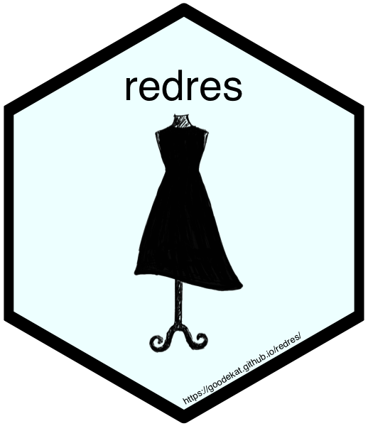
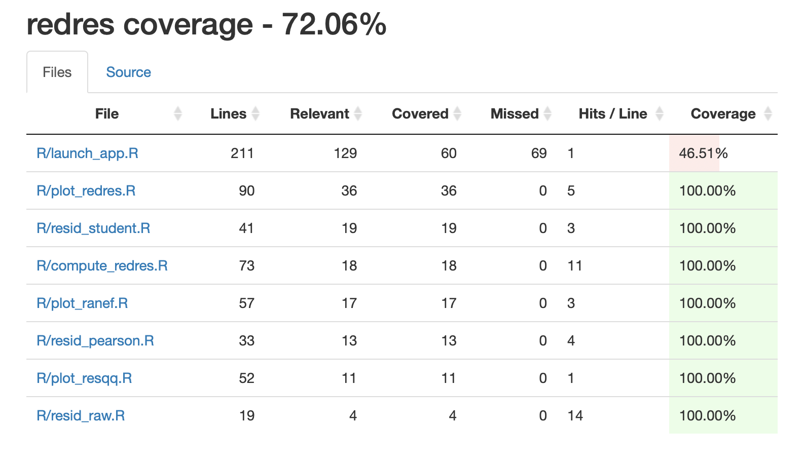
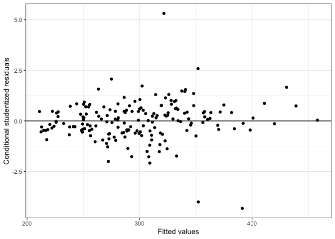
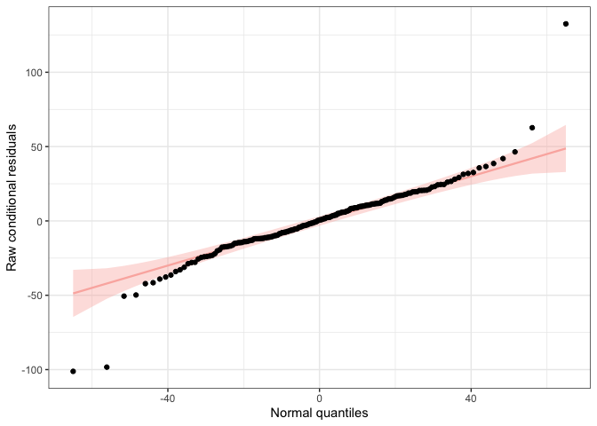
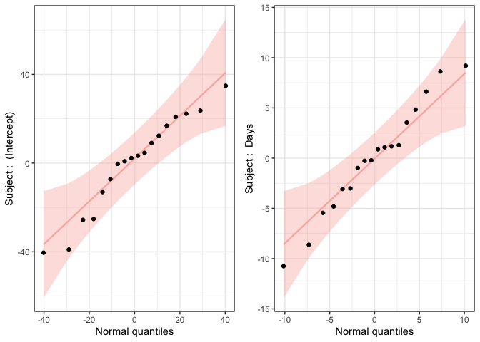
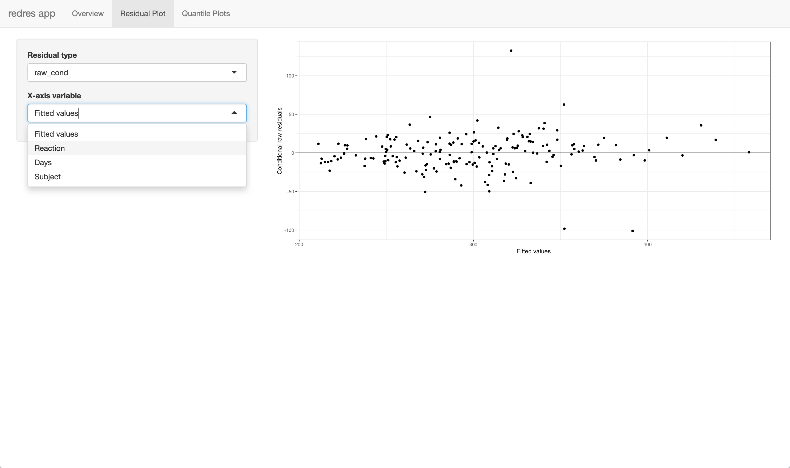
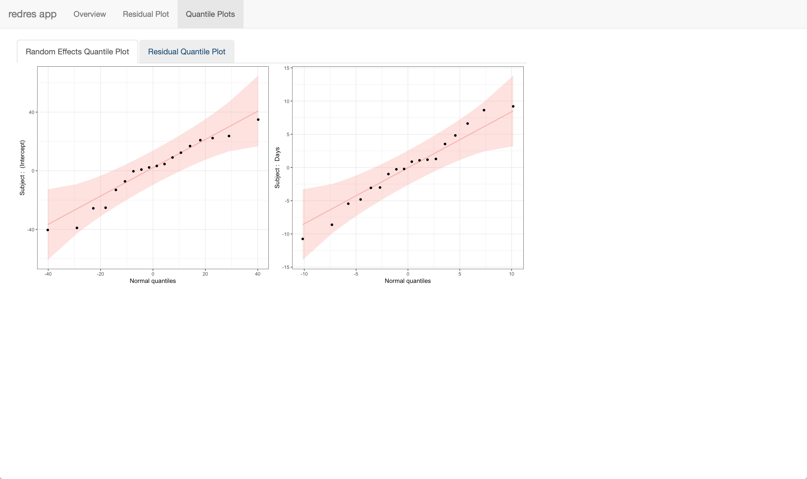

# redres 

`redres` is an R package developed to help with diagnosing linear mixed
models fit using the function `lmer` from the `lme4` package. It is
meant to supplement the `lme4` package.

<!-- badges: start -->

[](https://travis-ci.org/goodekat/redres)
[](https://codecov.io/gh/goodekat/redres?branch=master)
<!-- badges: end -->

Note that the code coverage is less than 90% due to our function
`launch_app` that runs the Shiny app. The other functions in the package
all have 100% code coverage. See the image below of the coverage report
(taken on May 6,
2019).



## Installation

`redres` can be installed from the GitHub repository using the devtools
package.

``` r
# Installs redres
devtools::install_github("goodekat/redres")
```

Once installed, the package can be loaded as usual.

``` r
# Loads the library
library(redres)
```

## Functions

The package contains the following functions.

#### compute\_redres

`compute_redres` computes residuals given an `lmer` model and a
specified residual type. The available residual types are listed below.

  - `"pearson_cond"`: Pearson conditional residuals
  - `"pearson_mar"`: Pearson marginal residuals
  - `"raw_cond"`: raw conditional residuals (default)
  - `"raw_mar"`: raw marginal residuals
  - `"std_cond"`: studentized conditional residuals
  - `"std_mar"`: studentized marginal residuals

<!-- end list -->

``` r
# fits an lmer model
library(lme4)
m <- lmer(Reaction ~ Days + (Days | Subject), data = sleepstudy)

# computes the default residuals (raw conditional)
rc_resids <- compute_redres(m)

# computes the Pearson marginal residuals
pm_resids <- compute_redres(m, type = "pearson_mar")

# computes the studentized conditional residuals
sc_resids <- compute_redres(m, type = "std_cond")

# puts the residuals in a data frame with observed response and prints the first six rows
resids <- data.frame(sleepstudy$Reaction, rc_resids, pm_resids, sc_resids)
head(resids)
```

    ##   sleepstudy.Reaction  rc_resids   pm_resids  sc_resids
    ## 1            249.5600  -4.103656 -0.05183533 -0.1827673
    ## 2            258.7047 -14.625218 -0.08778466 -0.6273601
    ## 3            250.8006 -42.195579 -0.57415555 -1.7645701
    ## 4            321.4398   8.777359  0.97108955  0.3616072
    ## 5            356.8519  24.523197  1.48694225  1.0048639
    ## 6            414.6901  62.695136  2.39621737  2.5789518

#### plot\_redres

`plot_redres` creates a plot (using `ggplot2`) of the residuals versus
the fitted values given a model and a specified residual type. All
residual types listed for `redres` work with
`plot_redres`.

``` r
# creates a plot of the conditional studentized residuals versus the fitted values
plot_redres(m, type = "std_cond")
```

<!-- -->

#### plot\_resqq

`plot_resqq` creates a normal quantile plot (using `ggplot2` and
`qqplotr`) of the raw conditional residuals, `raw_cond`. By the
assumptions of a model fit using `lmer` these residuals are expected to
be normally distributed. Obvious departures indicate an invalid
assumption. See
[vignette](https://goodekat.github.io/redres/articles/redres-vignette.html)
for more details about interpreting quantile plots.

``` r
# creates a residual quantile plot for the error term
plot_resqq(m)
```

<!-- -->

#### plot\_ranef

`plot_ranef` creates normal quantile plots for all random effects in the
model. Under the assumptions of a `lmer` model, each random effect term
is normally distributed. This function will return a grid of plots fit
using `ggplot2` and `qqplotr`.

``` r
# creates normal quantile plots for each random effect
plot_ranef(m)
```

<!-- -->

#### launch\_redres

`launch_redres` opens a Shiny app that includes interactive panels to
view the diagnostic plots from a model. The function can be used by
inputting one or two models into the app in the form of a vector. If two
models are input, the residual plots for each model will be shown side
by side in the app. Screen shots of the app are shown below.

``` r
# opens the app
launch_redres(m)
```





## Learn More

To learn more about `redres`, read through the
[vignette](https://goodekat.github.io/redres/articles/redres-vignette.html)
for `redres` which contains:

  - details on how the residuals are computed
  - explanations of how to use the different residual types
  - interpretations of the plots
  - examples using `redres` to assess the assumptions of a linear mixed
    model

Additionally, more information is available at the package
[website](https://goodekat.github.io/redres/).
