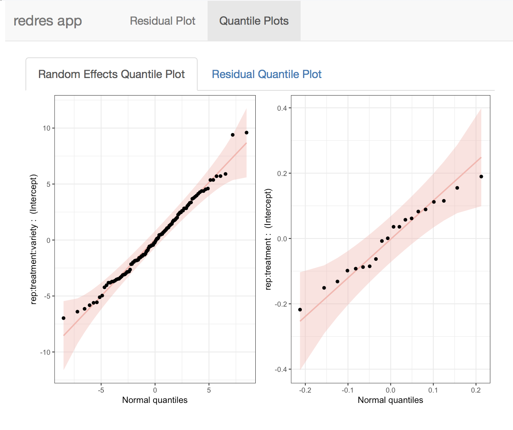

```{r setup, include = FALSE}
knitr::opts_chunk$set(
  collapse = TRUE,
  comment = "#>",
  fig.align = "center"
)
```

<br>

# Introduction

`redres` is an R package developed to help with diagnosing linear mixed models fit using the function `lmer` from the `lme4` package. It is meant as a supplemental package to `lme4`. The package can be installed from GitHub using devtools and then loaded in the usual way.

```{r eval = FALSE}
# Installs redres from GitHub
devtools::install_github("goodekat/redres")
```

```{r}
# Loads the package
library(redres)
```

## Overview

**redres** stands for **r**andom **e**ffect **d**iagnostic **res**iduals. This name was chosen based on the word redress, which the Merriam-Webster dictionary [defines](https://www.merriam-webster.com/dictionary/redress) as "to set right". When we fit a linear mixed model to data, we make several assumptions. These assumptions can be diagnosed by inspecting the residuals from the model. *Residuals allow us to set right* the more egregious misspecifications. No model is perfect, but residuals are an important line of defense against an inaccurate model and, consequently, poor inference.

## Package Structure

`redres` is structured so the available functions fall under one of three categories. These categories identify the type of model assessment experience the functions provide.

1. [Residual extraction](#resids): The first manner in which `redres` can be used is to obtain residuals from a model. This is done using the function [**`compute_redres`**](#compute_redres) to extract and return a vector of residuals of a specified type. The user then can perform their own methods of assessment with the residuals. The available [residual types](#types) are described later in the vignette.

\vspace{0.25cm}

2. [Diagnostic plot creation](#plots): The second way to utilize `redres` is to easily create diagnostic plots associated with a model using the following functions.
    - [**`plot_redres`**](#plot_redres): Creates a plot of residuals versus fitted values, the response variable, or explanatory variables for a given residual type
    - [**`plot_resqq`**](#plot_resqq): Creates a normal quantile plot for conditional residuals
    - [**`plot_ranef`**](#plot_ranef): Creates a normal quantile plot for the random effects
    
\vspace{0.25cm}

3. [Interactive model assessment](#app): Lastly, `redres` can be employed to facilitate an interactive model assessment experience. The function [**`launch_redres`**](#launch_redres) accepts one or two models and opens a Shiny app with diagnostic tools. Within the Shiny window, the user can view and interact with all plots available in the `redres` package. If two models are input, plots from each model are shown side by side to assist with model selection.

This vignette is set up to mimic the package structure. The sections after the introduction are dedicated to one of the three package uses. Additional details on the functions are included in these sections along with explanations of how to interpret the output and examples.

## Linear Mixed Models

Since `redres` is meant to supplement `lme4`, it is assumed that the user has previous experience with mixed models. However, a review of mixed model theory and assumptions are included here.

The linear mixed effects model can be written as
  $$\textbf{Y}=\textbf{X}\boldsymbol{\beta}+\textbf{Z}\boldsymbol{\gamma}+\boldsymbol{\epsilon}$$
where

- $\textbf{Y}$ is an $n\times 1$ vector of $n$ response variable observations,
- $\textbf{X}$ is an $n\times p$ matrix of $p$ explanatory variables with $n$ observations each,
- $\boldsymbol{\beta}$ is a $p\times1$ vector of unknown fixed effects parameters,
- $\textbf{Z}$ is an $n\times q$ matrix of $q$ random effect variables with $n$ observations each,
- $\boldsymbol{\gamma}$ is a $q\times1$ vector of unknown random effects, and
- $\boldsymbol{\epsilon}$ is an $n\times1$ vector of random errors.

Under this set up,
  $$E[\textbf{Y}]=\textbf{X}\boldsymbol{\beta} \ \ \ \mbox{ and } \ \ \ 
  Var[\textbf{Y}]=\textbf{ZGZ}'+\textbf{R}=\textbf{V}.$$
  
It is customary to assume that
$$ 
\begin{bmatrix} \boldsymbol{\gamma} \\ \boldsymbol{\epsilon} \end{bmatrix}
\sim N 
\begin{pmatrix} 
\begin{bmatrix} \boldsymbol{0} \\ \boldsymbol{0} \end{bmatrix},
\begin{bmatrix} \textbf{G} & \boldsymbol{0} \\ \boldsymbol{0} & \textbf{R}
\end{bmatrix}
\end{pmatrix}.
$$
With this set up, we can assess the following assumptions using residuals and diagnostic plots.

(1) Linear relationship between the response and the explanatory variables
(2) Constant variance
(3) Normality of the random effects and error term

## Example Data

`redres` contains a dataset called `paprika`, which will be used to demonstrate the functions in this vignette. The data are from a study on paprika plants grown under small-scale farming conditions in southern Africa. The original paper on the study can be found [here](https://link.springer.com/article/10.1007%2Fs10457-011-9415-2). The study was conducted in 2007 and 2008 in Malawi using a split plot design with five replicates. 

The researchers compared 4 fertilizer treatments and 6 plant varieties. The fertilizers were applied to the main plots, and the varieties were assigned to the subplots within a main plot. Within each replicate, 10 plants were randomly chosen from a fertilizer and variety treatment combination and observed over 20 weeks. 

The dataset included in `redres` contains observations from week 4 of the data in 2008. It is stored as a tibble with 1070 rows and 5 variables. The variables are

- `rep`: replicate number
- `treatment`: fertilizer treatment
- `variety`: plant variety
- `plant`: plant number (nested within rep, treatment, and variety)
- `height`: height of the plant (cm)

The first six rows of the data and a histogram of the response variable `height` are shown below.

```{r fig.width = 4, fig.height = 2}
# Prints the first 6 rows of the paprika data
head(paprika)

# Creates a histogram of the height variable
library(ggplot2)
ggplot(paprika, aes(x = height)) + 
  geom_histogram(bins = 35) + 
  theme_bw()
```

The code below fits a linear mixed effects model to the `paprika` dataset. This model will be used throughout this vignette. The terms included in the model are described below.

- `rep` is treated as a blocking variable and included as a fixed effect
- `treatment` is included as a fixed main effect
- `variety` is included as a fixed main effect
- `treatment:variety` is included as a fixed interaction term
- `rep:treatment` is included as a random effect to account for correlation within a main plot due to the split plot design
- `rep:treatment:variety` is included as a random effect to account for dependency between the 10 plants from a treatment by variety combination within a rep

```{r message = FALSE}
# Loads the lme4 package
library(lme4)

# Fits a linear mixed effects model
m <- lmer(height ~ rep + treatment*variety + (1|rep:treatment) + (1|rep:treatment:variety), 
          data = paprika)
```

<br>

# Extracting Residuals {#resids}

One of the ways to utilize `redres` is to extract residuals from a model fit using `lmer`. This can be done using the function in the package named `compute_redres`. A variety of residual types are available.

## Residual Types {#types}

`compute_redres` can compute both marginal and conditional residuals for the following types:

- raw
- Pearson
- studentized

It is not necessary to consider all residual types when diagnosing a mixed model. Certain types are beneficial in certain situations. For example, conditional residuals are useful for checking the effect of the random terms in the model as opposed to marginal residuals that do not account for the random effects. Studentized residuals are useful for checking constant variance with more complex variance structures. We have chosen to include all of these types so that the user may select which type (or types) is (are) useful for their situation. By default, `compute_redres` returns raw conditional residuals since these are appropriate for a wide range of cases.

The formulas for how the residual types are computed in `redres` are listed below. Note that some of these computations differ from the `residual` function in `lme4`. These changes were made so that the names provide a more intuitive understanding of how the types are computed.

### Raw Residuals

The raw residuals are computed as the observed response values minus the predicted response values. The marginal version does not account for the random effects while the conditional version does.

\vspace{0.25cm}

- **marginal** raw residuals
  $$r^m_i = Y_i-\textbf{x}'_i\widehat{\boldsymbol{\beta}}$$
  
- **conditional** raw residuals
  $$r^c_i = Y_i-\textbf{x}'_i\boldsymbol{\widehat{\beta}}-\textbf{z}'_i\widehat{\boldsymbol{\gamma}}$$

### Pearson Residuals

The Pearson residuals are computed as the raw residuals divided by the square root of the estimated variance of the response values.

\vspace{0.25cm}

- **marginal** Pearson residuals
  $$r^{m,Pearson}_{i} = \frac{r^m_i}{\sqrt{\widehat{Var}[Y_i]}}$$
  
- **conditional** Pearson residuals
  $$r^{c,Pearson}_{i} = \frac{r^c_i}{\sqrt{\widehat{Var}[Y_i|\boldsymbol{\gamma}]}}$$

### Studentized

The studentized residuals are computed as the raw residuals divided by the square root of the estimated variance of the raw residuals.

- **marginal** studentized residuals
  $$r_i^{m,std}=\frac{r_i^m}{\sqrt{\widehat{Var}[r_i^m]}}$$
  
- **conditional** studentized residuals
  $$r_i^{c,std}=\frac{r_i^c}{\sqrt{\widehat{Var}[r_i^c]}}$$

Note that
  $$\widehat{Var}[\textbf{r}^m]=\widehat{\textbf{V}}-\textbf{Q} \ \ \ \mbox{ and } \ \ \ \widehat{Var}[\textbf{r}^c]=\textbf{K}\left(\widehat{\textbf{V}}-\textbf{Q}\right)\textbf{K}'.$$
The values of $\textbf{Q}$ and $\textbf{K}$ are defined as follows by by Gregoire, Schabenberger, and Barrett (1995).

$$\textbf{Q}=\textbf{X}(\textbf{X}'\widehat{\textbf{V}}^{-1}\textbf{X})^{-}\textbf{X}' \ \ \ \mbox{ and } \ \ \ \textbf{K}=\textbf{I}-\textbf{Z}\widehat{\textbf{G}}\textbf{Z}'\widehat{\textbf{V}}^{-1}$$

## Usage

### compute_redres {#compute_redres}

The function `compute_redres` computes residuals for a given linear mixed model based on a specified residual type.

**Inputs**

- `model`: Model fit using 'lmer' from lme4.
- `type`:	String identifying type of residual. The following options are available:
      - `"pearson_cond"`: Pearson conditional residuals
      - `"pearson_mar"`: Pearson marginal residuals
      - `"raw_cond"`: raw conditional residuals (*default*)
      - `"raw_mar"`: raw marginal residuals
      - `"std_cond"`: studentized conditional residuals
      - `"std_mar"`: studentized marginal residuals  
      
**Output**

- Returns a vector of residuals according to type specified. Residuals appear in the same order as the observations used to fit the model.

**Functionality** 

The code below demonstrates the use of `compute_redres` to compute several types of residuals from the `paprika` model. The residuals are joined with the `paprika` data, and the first six rows are printed.

```{r}
# Computes the default residuals (raw conditional)
raw_cond <- compute_redres(m)

# Computes the Pearson marginal residuals
pearson_mar <- compute_redres(m, type = "pearson_mar")

# Computes the studentized conditional residuals
std_cond <- compute_redres(m, type = "std_cond")

# Joins the residuals to the paprika data
paprika_plus <- cbind(paprika, raw_cond, pearson_mar, std_cond)

# Prints the head of the data
head(paprika_plus)
```

The user can then use these residuals as desired. For example, the user could make their own plots or perform tests on the residuals. The code below performs a Shapiro-Wilk test for normality on the raw conditional residuals and creates histograms of the three residual types. The p-value from the normality test is extremely small, which suggests that there is evidence that the distribution of the residuals is different from a normal distribution. The histograms of the both the raw and studentized residuals show that the distribution of the residuals is symmetric and uni-modal but has more observations in the tails than would be expected from a normal distribution. 

```{r message = FALSE, fig.width = 6, fig.height = 2}
# Performs a test for normality on the raw conditional residuals
shapiro.test(paprika_plus$raw_cond)

# Loads helpful libraries 
library(dplyr)
library(tidyr)

# Creates histograms of the residual types
paprika_plus %>%
  gather(key = "type", value = "residual", 6:8) %>%
  ggplot(aes(x = residual)) + 
  geom_histogram(bins = 30) + 
  facet_grid(. ~ type, scales = "free") + 
  theme_bw()
```

<br>

# Plotting Residuals {#plots}

`redres` can also be used to assess linear mixed model assumptions by creating diagnostic plots using the functions of [`plot_redres`](#plot_redres), [`plot_resqq`](#plot_resqq), and [`plot_ranef`](#plot_ranef).

## Plot Types

Two types of plots (residual and quantile plots) are utilized by `redres`.

### Residual Plots 

Plots of the residuals versus fitted values, the response variable, or explanatory variables (covariates) are used to verify linearity and constant variance. If no curvature or additional linear trends are identified in the residual plot, we say that the linear form is a reasonable assumption. To assess the constant variance assumption, we want the vertical spread of the residuals to be approximately the same in the y-axis direction for all x-axis values. Using a scaled residual, either the studentized or Pearson, is necessary to account for additional variance structures modeled outside of the error term.

Residual plots can be rendered via `redres` using the `plot_redres` function. The user has the ability to specify either fitted values or a explanatory variable from the model. Additionally any of the six [types of residuals](#types) can be used in the plot.

### Quantile plots

Quantile plots are used to visually verify if data follow a particular distribution. Data points are plotted along the quantiles of the assumed distributed. The data are expected to follow an approximately straight line (at least along the middle quantiles). The points are assessed for any extreme curvation that would indicate a departure from the assumed distribution. Typically curvature at the extreme ends of the quantiles (around 0 and 1) are ignored as data are sparse here and distributions behave more erratically at the boundaries of the parameter space.  

The function `plot_ranef` plots each random effect vector versus normal quantiles. From the assumptions of the linear mixed model, each random effect specified is assumed to follow a normal distribution. Therefore, these plots can be used to assess if this assumption is met. We have added 95% normal-theory confidence bands to guide the user. Note that the number of plots generated by this function will vary for each model based on the number of random effects.

The error term is assumed to follow a normal distribution as well. The function `plot_resqq` provides a normal quantile plot with 95% confidence bands for the raw conditional residuals to assess this assumption.

Both of these functions generate the quantile plots using the R package [`qqplotr`](https://github.com/aloy/qqplotr).
 
## Usage

### plot_redres {#plot_redres}

`plot_redres` creates a plot of residuals versus fitted values or model variable. This plot can be used to assess whether the assumptions of constant variance and linear form assumptions are adequate.

**Inputs**

- `model`: Model fit using 'lmer' from lme4.
- `type`:	String identifying type of residual. Default is 'raw_cond'. The same options available with [`compute_redres`](#compute_redres) are available for `plot_redres`.
- `xvar`: String indicating the variable to be plotted on the x-axis. By default, the fitted values are plotted on the x-axis. Any variable used in the 'lmer' model can be specified.

**Output**

- A residual plot in the form of a `ggplot2` object.

**Functionality**

The code below shows how to create the most basic plot using `plot_redres`. By inputting the model `m`, a plot of the conditional raw residuals versus the fitted values is returned. We see that there is the classic "fan" shape indicating inconstant variance. As the fitted values increase, the vertical spread of the residuals also increases. The lack of any other trend in the residuals suggests that the linear form assumption is reasonable. We should try alternative model formulations in order to address the inconstant variance.

```{r fig.height = 2.5, fig.width = 4}
# Creates the default residual plot
plot_redres(m)
```

Perhaps we are additionally interested in the marginal effect of variety, so we want to see the residuals by variety of paprika planted. The code below adjusts the `xvar` option, and the resulting plot suggests that there is no need for any extra structure for modeling height.
 
```{r fig.height = 2.5, fig.width = 4}
# Plots the raw conditional residuals against the variety fixed effect
plot_redres(m, xvar = "variety")
```

The type of residuals can be changed using the `type` option as shown in the code below. The marginal residuals show an upward trend as the fitted values increase. From our experimental design, we suspect that this trend might be related to the replications.

```{r fig.height = 2.5, fig.width = 4}
# Creates the residual plot with raw marginal residuals
plot_redres(m, type = "raw_mar")
```

When we plot the residuals now by replication ID, we see the same upward trend as replication ID increases. If we plot the residuals by treatment, we do not see this trend.

```{r fig.height = 2.5, fig.width = 6}
# Plots the raw marginal residuals against rep and treatment
rep_plot <- plot_redres(m, type = "raw_mar", xvar = "rep")
trt_plot <- plot_redres(m, type = "raw_mar", xvar = "treatment")
cowplot::plot_grid(rep_plot, trt_plot)
```

All plots created using the `redres` package are formatted to use `theme_bw` from `ggplot2`. However, since `plot_redres` returns a `ggplot2` object, it is possible to use functions provided by `ggplot2` to add additional "layers" (such as formatting options) to the plot.

```{r fig.height = 2.5, fig.width = 4}
# Applies additional ggplot2 layers to the output from plot_redres
library(ggplot2)
plot_redres(m, type = "pearson_cond") +
  geom_smooth(method = "loess") +
  theme_classic() +
  labs(title = "Residual Plot")
```

### plot_resqq {#plot_resqq}

`plot_resqq` creates a normal quantile plot of the raw conditional residuals. For linear mixed models, these residuals are expected to be normally distributed. This plot can be used to assess this assumption.

**Inputs**

- `model`: A model fit using `lmer`.

**Output**

- A normal quantile plot in the form of a `ggplot2` object with normal theory 95\% confidence bands.

**Functionality**

We can check our normal assumption on the error terms for our `paprika` model using `plot_resqq`. From the quantile plot, we see that along the middle of the distribution (around zero) the points fall in roughly a straight line with no S-shaped curvature, but the points away from the center deviate from the line suggesting that the residuals do not follow a normal distribution. This agrees with the result from the Shapiro-Wilk test performed earlier in the vignette. Since the deviation is not too drastic, and there are a lot of observations, we may choose to ignore this assumption violation and focus on the non-constant variance violation.

```{r fig.height = 2.5, fig.width = 4}
# Creates the normal quantile plot of the residuals
plot_resqq(m)
```

### plot_ranef {#plot_ranef}

`plot_ranef` plots each random effect in the model against the normal quantiles. For linear mixed models, random effects are assumed to be normally distributed. This plot can be used to assess the validity of that assumption.

**Inputs**

- `model`: A model fit using `lmer`.

**Output**

- A grid of normal quantile plots with normal theory 95% confidence bands in the `ggplot2` framework for all random terms in the model.

**Functionality**

We now check our normal assumption on the random effects for our `paprika` model using `plot_ranef`. Our model `m` has two random effects - a random intercept for $rep \times treatment \times variety$ and another random intercept for $rep \times treatment$. Therefore, `plot_ranef` produces a grid of two plots where the random effect term is identified along the y-axis. We see that the points fall along the straight reference lines and are well-within the confidence bands. We can conclude that the normal assumption for both random effect terms is not violated.

```{r fig.height = 2.5, fig.width = 6}
# Creates the normal quantile plots for the random effects
plot_ranef(m)
```

<br>

# Interacting with Residuals {#app}

The final way to make use of `redres` is to interactively assess the model assumptions using a Shiny app accessed using the function `launch_redres`.

## Shiny App

The function `launch_redres` opens a Shiny app that generates output for the plotting functions `plot_redres`, `plot_resqq`, and `plot_ranef`. There are two main tabs in the app, one for the residual plot and another for the quantile plots. The residual plot gives the user a choice of all [residual types](#types) and x-axis variables. The available x-axis variables are extracted from the input model.  

When a list of two models is input into `launch_redres`, the app shows a side-by-side comparison of the plots from each model. The user then is able to visually compare the two linear mixed models and conduct model selection.

## Usage

### launch_redres {#launch_redres}

`launch_redres` opens a Shiny app for diagnosing mixed models.

**Inputs**

- `model`: A model (or two models wrapped in a list) fit using `lmer`.

**Output**

- A `shiny` app.

**Functionality** 

*One model*: The code below shows how to access the `shiny` app using `launch_redres`. By inputting the model argument as `m`, a `shiny` app window will appear.

```{r, eval = FALSE}
# Creates a shiny app with only model
launch_redres(m)
```

The first page includes a table of the data used to fit the model and a printout of the call of the model.


Two selection widgets are included in the `Residual Plot` tab that allow the user to choose the [residual types](#types) to be shown on the y-axis and the variable to be plotted x-axis variable. These can be see in the screen shot of the app below.


The `Quantile Plots` page shown below contains two tabs. The first shows the random effects normal quantile plots, and the second shows the error term normal quantile plot.




*Two models*: In an attempt to redress the non-constant variance assumption with the `paprika` model, a second model is fit below with a log transformation of the response variable. The random effect of `rep:treatment` is also left out of the model, because when it is included in the model with a log transformed response, its associated variance component is estimated to be 0.

```{r}
# Fits a linear mixed model after log transforming the response
mlog <- lmer(log(height) ~ rep + treatment*variety + 
               (1|rep:treatment:variety), 
             data = paprika)
```

The two models can be combined in a list and input to `launch_redres` as shown below.

```{r, eval = FALSE}
# Combines the two models in a list
cmbd <- list(m, mlog)

# Creates a shiny app with two models
launch_redres(cmbd)
```

In this case, the Shiny app shows the residual plots side by side. Again, a selection is available for the residual type. For variables on the x-axis, separate selectors are included for each model to allow for cases when the two models have different variables. The quantile plots are also shown side by side.


```{r echo = FALSE, results = FALSE}
# copy static figures to docs folder
file.copy("./figs", "../docs/articles/", overwrite = TRUE, recursive = TRUE)
```
